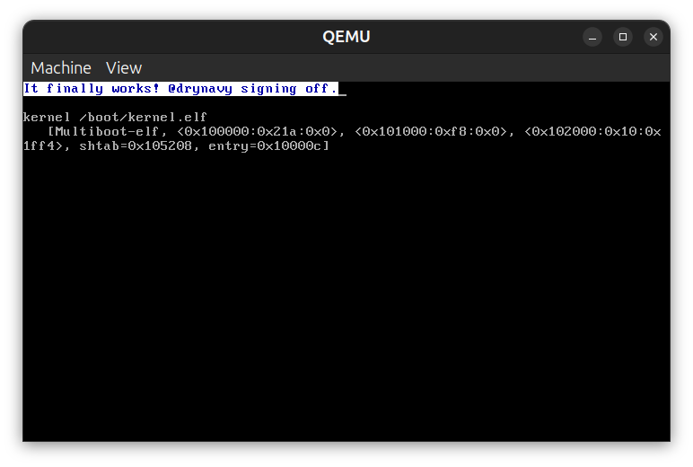
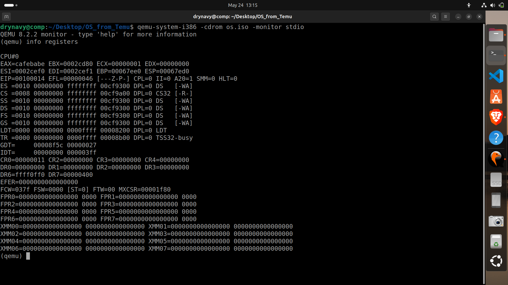

# myOS

A minimal x86 operating system kernel built from scratch, following
The Little Book About OS Development by Erik Helin and Adam Renberg.

## What it does

Boots via GRUB multiboot and runs entirely in 32-bit protected mode.
Sets up a Global Descriptor Table (GDT) for memory segmentation, an
Interrupt Descriptor Table (IDT) for interrupt handling, and remaps
the Programmable Interrupt Controller (PIC) so hardware interrupts
land at the correct vectors. Keyboard input is handled via IRQ1 with
a scancode-to-ASCII translation table. All output goes through a
custom framebuffer driver that writes directly to video memory at
0xB8000 with configurable foreground and background colors. Hardware
communication is done entirely through memory-mapped I/O and I/O
ports with no libraries or shortcuts.

Virtual memory is managed through x86 paging. A page directory is
configured at boot with 4 MB pages and identity mapping over the first
4 MB of physical memory, allowing the kernel to continue executing
after the paging unit is enabled. Physical memory is tracked by a
bitmap-based page frame allocator that reads available memory from the
GRUB multiboot structure, marks kernel and BIOS regions as reserved,
and exposes alloc and free operations for 4 KB page frames.

A read-only file system is loaded as a GRUB module at boot. The file
system image is built at compile time by a host-side tool that
concatenates files with metadata headers into a single binary blob.
The kernel parses the image header, validates a magic number, and
exposes file access through a minimal virtual file system layer with
mount, open, and read operations. File contents are read directly from
the module's physical address with no disk I/O required.





## Tools Required

- NASM - assembler
- GCC - C compiler
- GNU LD - linker
- genisoimage - ISO image creation
- QEMU - x86 emulator

## Build

```bash
make
```

## Run

```bash
make run
```

## Clean

```bash
make clean
```
